# Role-Based Dashboard App 

A Flutter app featuring **🧑‍💼Admin, 👩‍🏫Instructor, and 👨‍🎓Student dashboards** — each with unique functionality, clean UI, and local data persistence.

## 👨‍🎓 **Student Dashboard**

✅ Manage learning tasks (mark complete/incomplete).  
🗒️ Each task shows title & description with checkbox.  
🎨 Green theme for student view.

## 🧑‍💼 **Admin Dashboard**

🧾 Add User form (Name + Role dropdown).  
⚠️ Validation: Empty names show Snackbar warning.  
👥 Display, edit, and delete users locally.  
💾 Data saved with SharedPreferences (persists after restart).  
🔢 Shows total user count in AppBar.  
🎨 Red theme maintained for consistency.

## 👩‍🏫 **Instructor Dashboard**

📤 Upload tasks & view student submissions.  
👨‍👩‍👧 Track student performance easily.  
🎨 Blue theme for instructor view.

---

## 📸 Screenshots of 👨‍🎓Student Dashboard Task 5

  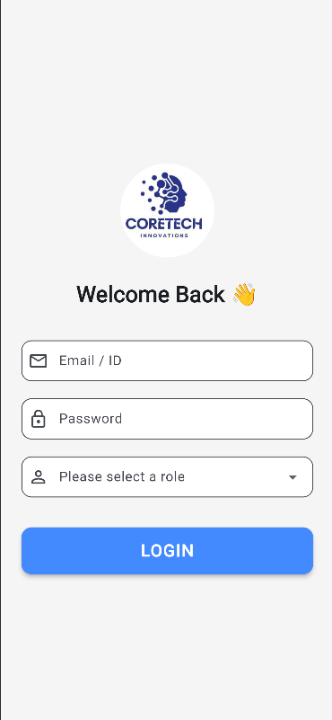
  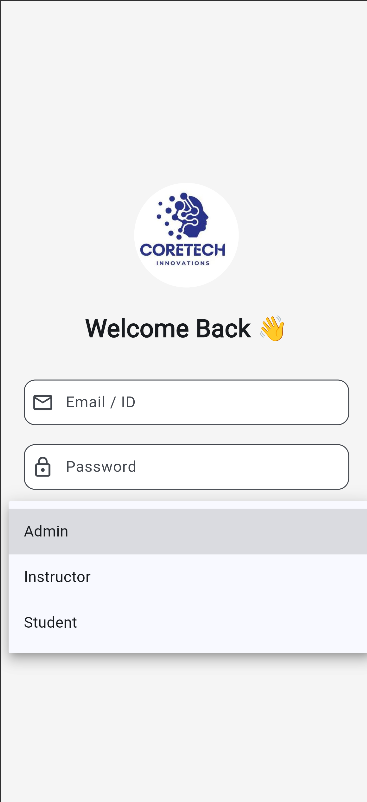
  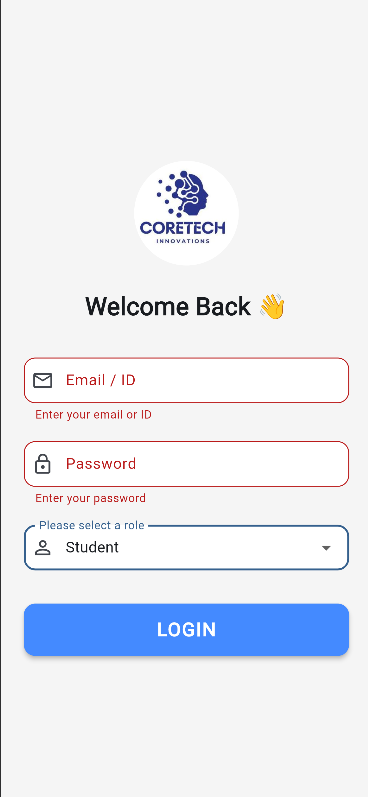
  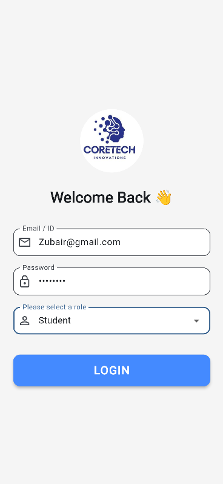
  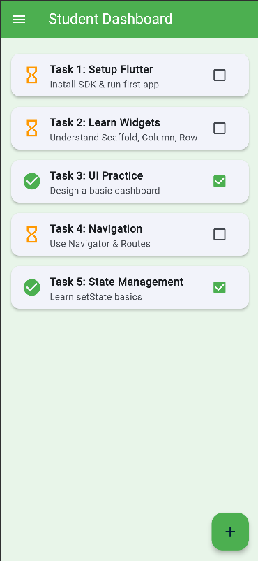
  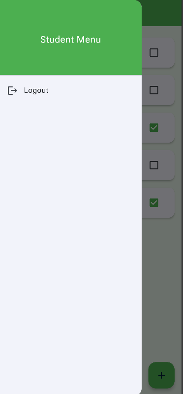
  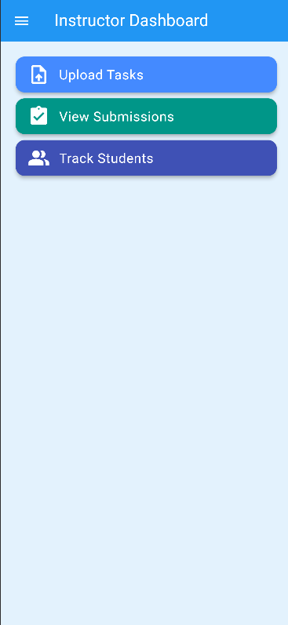
  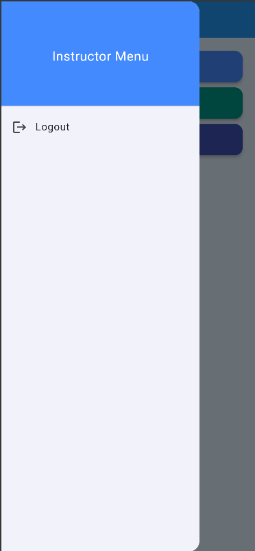

---

## 📸 Screenshots of 🧑‍💼Admin Dashboard Task 6

  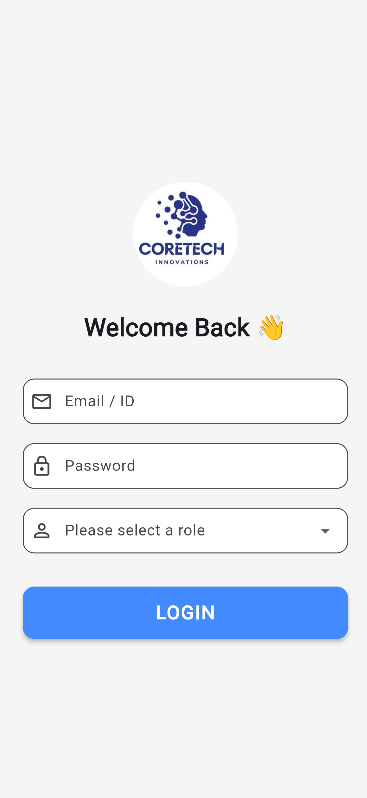
  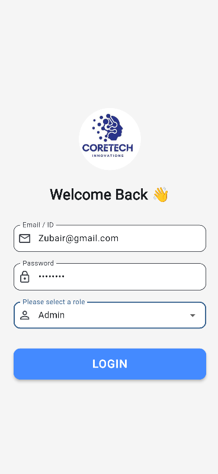
  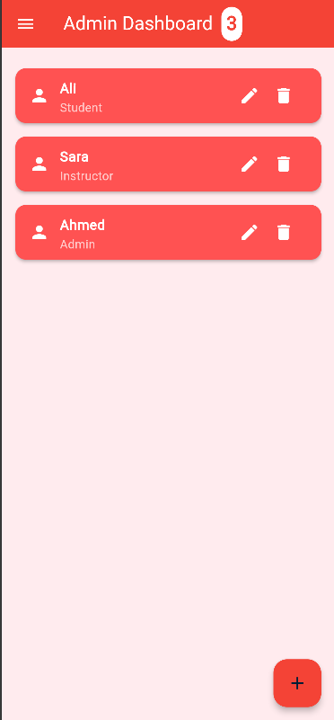
  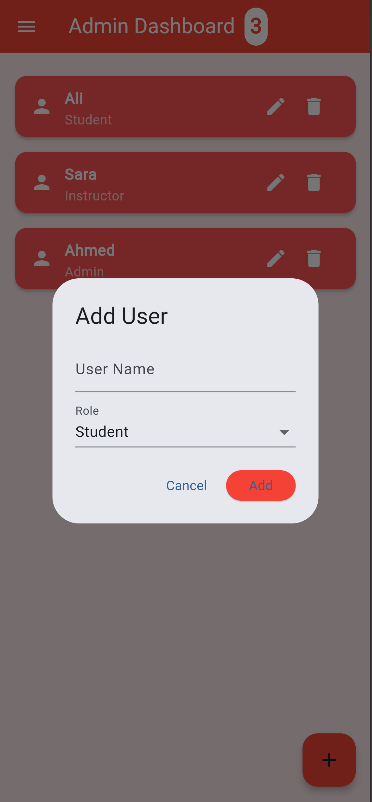
  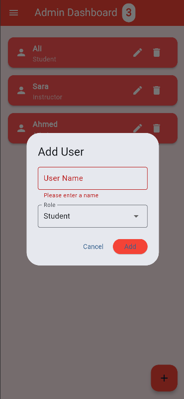
  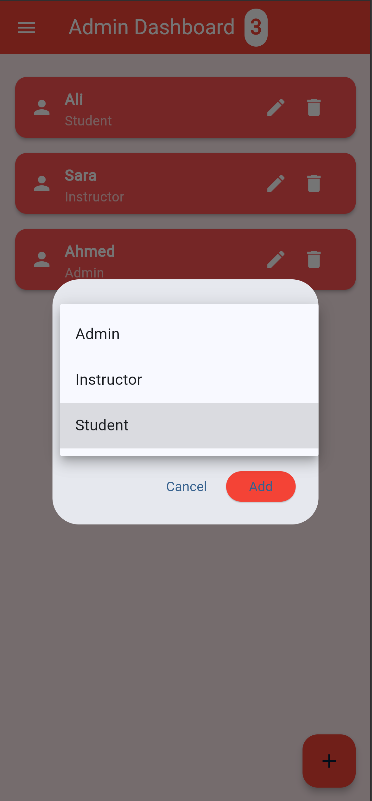
  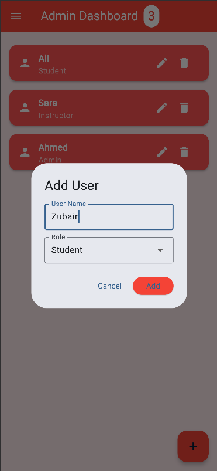
  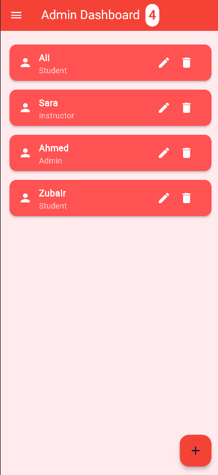
  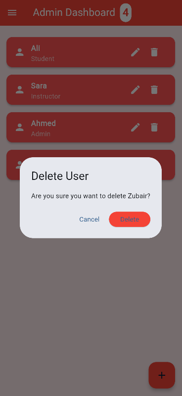
  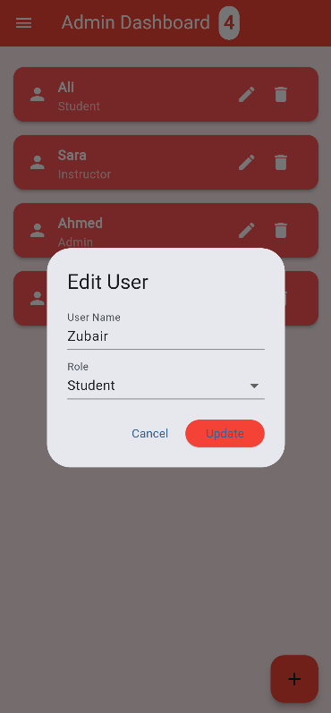
  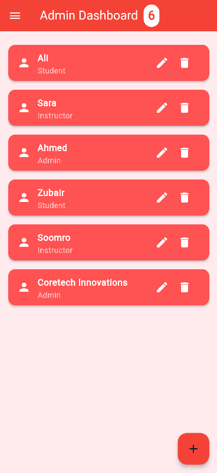
  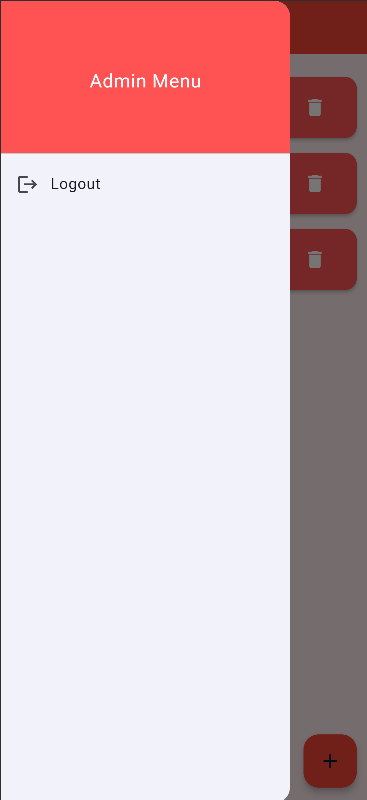

---

## ⚙️ **Tech Used**

Flutter (Dart)  
💾 SharedPreferences  
🔀 Navigator (Named Routes)

---

👨‍💻 Zubair Ahmed  
**🏢 CoreTech Software House Internship — Task #6**
